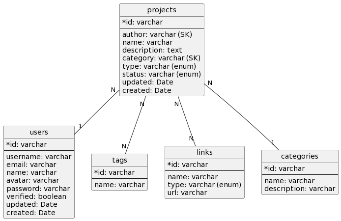

# Project Status : Database

## Table Of Contents

- [Project Status : Database](#project-status--database)
  - [Table Of Contents](#table-of-contents)
  - [Database](#database)
  - [Database Diagram](#database-diagram)

## Database

Entity Name :

- **user** : User Management
- **groups** : Groups Management
- **technologies** : Technologies Management
- **links** : Links Management
- **gits** : Gits Management
- **rewards** : Rewards Management
- **projects** : Projects Management

## Database Diagram

